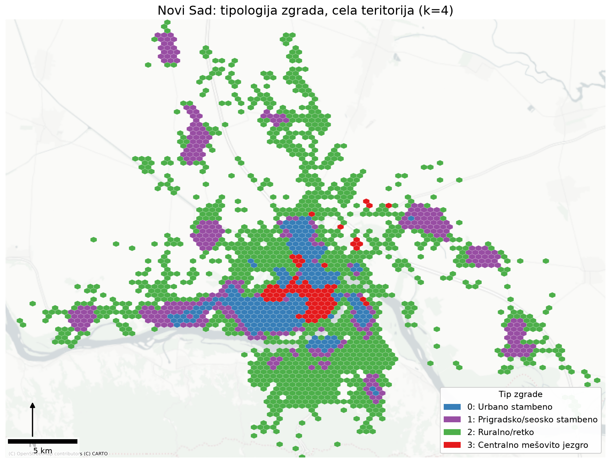

# Tipologija zgrada Novog Sada

Tipologija zgrada deli grad na tipove izgradnje, npr. gusto stambeno jezgro, prigradska
sela ili rasute ruralne objekte. Tipovi se ovde ne zadaju unapred, nego ih klasterovanje
otkriva iz podataka: svaka od preko 100k novosadskih zgrada opisana je atributima svoje
geometrije i okoline, a zgrade sličnih atributa završavaju u istom tipu.



Ovaj projekat za predmet Mašinsko učenje gradi tipologiju iz tri otvorena izvora podataka
(Overture Maps, Sentinel-2, OpenStreetMap) i prikazuje je na mapama po zgradi.

```
 ┌───────────────┐   ┌─────────────────────┐   ┌─────────────────┐
 │ Overture Maps │   │ Sentinel-2 (openEO) │   │  OpenStreetMap  │
 │ otisci zgrada │   │  NDVI/NDBI rasteri  │   │ sadržaji, mreža │
 └───────┬───────┘   └──────────┬──────────┘   └────────┬────────┘
         │                      │                       │
         └──────────────────────┼───────────────────────┘
                                │
                ┌───────────────▼────────────────┐
                │  izvođenje atributa po zgradi  │
                └───────────────┬────────────────┘
                                │
                ┌───────────────▼────────────────┐
                │ standardizacija, PCA, k-means  │
                └───────────────┬────────────────┘
                                │
                ┌───────────────▼────────────────┐
                │     tipologija (k = 2/3/4)     │
                └───────────────┬────────────────┘
                                │
                ┌───────────────▼────────────────┐
                │     mape i profili tipova      │
                └────────────────────────────────┘
```

## Kako radi

Pipeline ima tri faze, `main.py` ih pokreće redom.
1. **Granica**: [boundary.py](scripts/preprocessing/boundary.py) uzima administrativnu granicu
   Novog Sada, ceo grad sa selima (~700 km²), da tipologija obuhvati i urbano i ruralno.
2. **Zgrade**: [buildings.py](scripts/preprocessing/buildings.py) preuzima otiske iz
   Overture Maps, zadržava one unutar granice i izvodi površinu i spratnost.
3. **Satelit**: [satellite.py](scripts/preprocessing/satellite.py) preko openEO pravi
   letnji kompozit Sentinel-2 snimaka (medijanom se uklanja uticaj oblaka) i računa NDVI (zelenilo) i
   NDBI (izgrađenost).
4. **Sadržaji i mreža**: [pois.py](scripts/preprocessing/pois.py) svrstava OSM tačke u 8
   kategorija (prodavnice, škole...); [roads.py](scripts/preprocessing/roads.py) preuzima
   voznu uličnu mrežu.
5. **Atributi**: [features.py](scripts/preprocessing/features.py) za svaku zgradu računa
   21 atribut.
6. **Klasterovanje**: [cluster.py](scripts/modeling/cluster.py) standardizuje atribute,
   svodi ih PCA-om na komponente koje nose određeni procenat varijanse, pa pokreće k-means.

### Atributi

Tri nivoa opisa:

- **Geometrija objekta**: površina, obim, kompaktnost, spratnost.
- **Pristupačnost**: rastojanje do najbliže prodavnice, škole, raskrsnice i centra grada.
- **Sastav okoline** u krugu poluprečnika 300 m (pešačka skala): gustina i prosečna
  veličina zgrada, pokrivenost krovovima, gustina i raznovrsnost sadržaja, gustina mreže
  i raskrsnica, prosečan NDVI/NDBI.

### Izbor broja klastera

[k_selection.py](scripts/modeling/k_selection.py) gradi Ward hijerarhiju i traži najveće
skokove u spajanju (prirodne rezove). Radi na uzorku od 30k zgrada, ponovljeno na **20
nezavisnih uzoraka** radi stabilnosti:

- najveći skok → **k=2** u 15/20 uzoraka: robusna makro-podela (izgrađeno vs rasuto);
- drugi skok → **k=3** modalno (9/20), k=4 u 5/20: finiji rez je dvosmislen.

**k=4 je usvojen kao operativna tipologija** (jedina granularnost koja izdvaja centralno
mešovito jezgro), uz k=2 i k=3 kao prikazane alternative. Tipovi (k=4): Urbano stambeno,
Prigradsko/seosko stambeno, Ruralno/retko, Centralno mešovito jezgro.
[comparisons.py](scripts/modeling/comparisons.py) dodatno poredi Ward vs k-means (ARI),
PCA vs slučajnu projekciju i konfiguracije k-means-a.

### Validacija

Nema referentne tipologije, pa se rezultat proverava iz tri ugla: profili klastera
(šta definiše svaki tip), unakrsna tabela sa Overture namenom objekta (oznaka van
klasterovanja) i prostorna uverljivost na mapi (jezgro pada na centar grada, sela se
izdvajaju).

## Pokretanje

```bash
python -m venv .venv && .venv\Scripts\activate
pip install -r requirements.txt
python main.py                  # ceo pipeline, redom (iz korena repozitorijuma)
```

openEO korak traži prijavu na Copernicus prvi put. Pojedinačni korak se
pokreće kao modul, npr. `python -m scripts.preprocessing.features`; k-means sa drugim k
kao `python -m scripts.modeling.cluster 5`. `data/` se ne čuva u gitu, pipeline ga
reprodukuje iz izvora.
